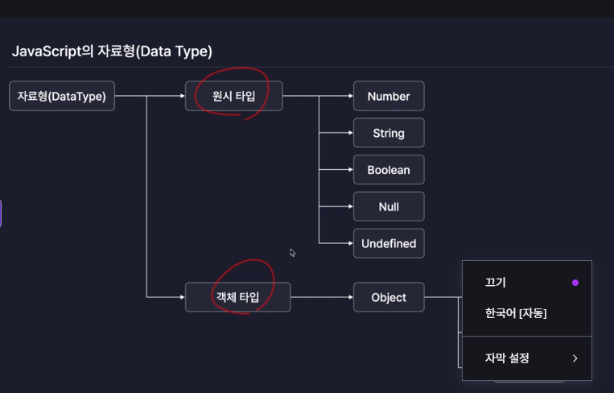

React는 Node.js기반의 JavaScript라이브러리
-> JavaScript를 먼저 배워야함.

## JavaScript란?

오늘날 가장 많이 사용 되는 프로그래밍 언어

#### JavaScript는 어떤 역할을 할까?

- 웹 서버
- 데스크탑, 모바일 어플리케이션
- 사실은 웹페이지를 개발하기 위해 만들어진 언어
- 버튼을 클릭했을 때 어떤 동작을 할 것인지와 같은 웹 내부에서 발생하는 상호작용 같은 기능들을 구현
  ex . 버튼을 클릭했을 때 경고창을 띄워줌.

#### JavaScript는 어떻게 실행될까?

- JavaScript는 JavaScript 엔진에 의해 실행됨.
- JavaScript 엔진 = 게임 구동기(=닌텐도).게임시디가 아무리 많아도 닌텐도 같은 구동기가 없으면 실행할 수 없음.
- 이 엔진은 기본적으로 크롬이나 사파리같은 웹브라우저에 탑재되어 있음.
  -> 자바스크립트 코드를 입력하면 브라우저에 내장되어 있는 자바스크립트 엔진으로 입력한 코드를 실행.

#### JavaScript문법

1. 변수와 상수
2. 자료형
   
