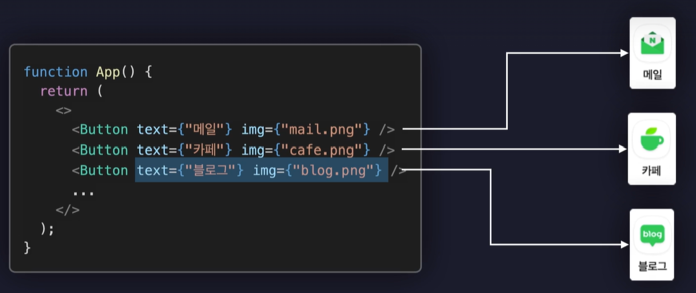

### jsx란? 문법 설명
- JavaScript Extensions로 확장된 자바스크립트의 문법을 말함
- 자바스크립트와 html을 혼용해서 사용할 수 있음 ex. 컴포넌트 안에 return값으로 html을 주는 것
- 동적으로 특정 변수의 값을 html로 렌더링 할 수도 있음
- 자바스크립트 값을 html로 렌더링하고 싶다면 중괄호 안에 작성하면 됨
- 중괄호 안에는 연산식(number+10), 삼항연산자(number % 2 === 0 ? "짝수" : "홀수") 다 가능함.

### jsx주의사항
1. 중괄호 내부에는 자바스크립트 표현식만 넣을 수 있다
- 중괄호 안에 조건문이나 반복문 같은건 사용 불가

2. 숫자, 문자열, 배열 값만 정상적으로 렌더링 된다. 
- {true} ,{null},{undefined} 같은건 렌더링 안됨.
- {10}, {number}, {[1,2,3]}은 됨
- const obj = { a: 1};
- {obj}하면 오류남. => 객체는 그대로 렌더링 하면 안되고, {obj.a}처럼 점 표기법을 사용해서 렌더링 해줘야함.

3. 모든 태그는 닫혀있어야한다. 
-  로 하거나 </img>처럼

4. 최상위 태그는 반드시 하나여야만 한다.
const Main = () => {

    const number = 10;
    return (
        <main>
            <h1>main</h1>
            <h2>{number }</h2>
        </main>);
};
여기서 <main>이 최상위 태그임
- 마땅히 묶을 태그가 없으면 <></> 빈 태그로 묶어도 됨 => 빈 태그로 묶으면 요소들이 흩어져 있음

### jsx에서 DOM요소(html)에 스타일을 적용하는 방법

1. DOM요소에 직접 스타일 속성을 설정
예시
 if(user.isLogin){
        return 
로그아웃

    }
- css에 했던 것 처럼 border-bottom이렇게 하면 안되고 이어서 작성해야함.
- 값은 문자열로 작성
- 연결되는 단어를 대문자로 시작하는 표기법을 카멜 표기법(Camel Case)이라고 함

2. 별도의 css파일을 만들어서 적용

### Props 란?

- 리액트 컴포넌트에게 값을 전달하는 방법
- 리액트는 페이지를 컴포넌트라는 단위로 나누어서 마치 레고를 조립하듯 개발함

- 이처럼 부모 컴포넌트가 자식컴포넌트(Button)에게 값을 전달 할 수 있음
- 이때, 전달된 값들을 Props라고 함
- Properties의 줄임말
- Props는 객체로 묶여서 자식 컴포넌트의 매개변수로 전달됨

- 만약 전달하는 Props의 값이 많다면 그 값들을 하나의 객체로 묶어서 스프레드 연산자를 통해 한 번에 전달하도록 할 수 있음
ex. <Button {...buttonProps} />
- Props의 값은 일반적인 값뿐만아니라 html요소(
자식 요소
)나 컴포넌트 값(<Header/>)도 전달할 수 있음
- 자식요소로 배치되어 전달된 html요소나 컴포넌트는 자식 컴포넌트에게 children이라는 이름의 Props로 자동 전달이 됨.

### 이벤트 핸들링

- Event란? 웹 내부에서 발생하는 사용자의 행동 ex. 버튼 클릭, 메세지 입력, 스크롤 등
- Event Handling이란? 이벤트가 발생했을 때 그것을 처리하는 것 ex. 버튼 클릭시 경고창 노출

- 이벤트를 처리하는 함수를 이벤트 핸들러라고 함
<button 
        onClick={()=>{
            console.log(text);
        }} // 이벤트 핸들러 
        style={{ color : color}}>
            {text} - {color.toUpperCase()}
            {children}
        </button>

- 리액트에서 발생하는 모든 이벤트들은 호출되는 이벤트 핸들러 함수에 매개변수로 이벤트 객체라는 것을 제공함.
- 합성이벤트(Synthetic Base Event): 모든 웹 브라우저의 이벤트 객체를 하나로 통일한 형태
cf.크로스 브라우징 이유(Cross Browsing Issue): 브라우저 별 스펙이 달라 발생하는 문제 => 이를 해결하는 것이 리액투의 합성 이벤트라는 객체 

### State - 상태 관리하기

- State: 현재 가지고 있는 형태나 모양을 정의, 변화할 수 있는 동적인 값
- State값을 갖는 리액트 컴포넌트를 만들 수 있음
 => State의 값에 따라 렌더링되는 UI가 결정됨

- useState()함수는 두개의 요소가 들어있는 배열을 반환함
첫번째 요소: 새롭게 생성된 State의 값, 인수로 초기값 0을 넣으면 초기값이 반환됨 -> state의 현재값
두번째 요소: 상태를 변화시키는 함수 -> 상태변화함수

- 함수 컴포넌트를 렌더링 한다 = App함수를 다시 호출하고 새롭게 반환한 값을 다시 렌더링 한다
- => 리액트 컴포넌트에서 변화하는 가변적인 값을 화면에 렌더링하고 싶다면 일반 변수가 아닌 state를 이용해야한다.

### State를 Props로 전달하기 
- 리액트 컴포넌트들이 리 렌더링 되는 상황
1. 자신이 관리하는 state값이 변경되었을 때
2. 자신이 제공받는 props의 값이 변경되었을 때
3. 부모 컴퍼넌트가 리렌더링 될 때

### useRef

- 새로운 Reference 객체를 생성하는 기능
const refObject = useRef()
- useState와 다른 점: useState는 값이 변경되면 컴포넌트를 리렌더링하지만, useRef로 생성한 변수는 어떤 경우에도 리렌더링을 유발하지 않음.
- 또한, useRef를 이용하면 컴퍼런스가 렌더링하는 특정 돔 요소에 접근할 수 있응 -> 해당 요소 조작 가능(포커스를 준다거나 스타일을 변경)
- {current: undefined} -> current라는 프로퍼티에 보관할 값을 담아두는 자바스크립트의 객체

### React Hooks
- 클래스 컴포넌트의 기능을 함수 컴포넌트에서도 이용할 수 있도록 하는 메서드들 
- useState: State기능을 낚아채오는 Hook
- useRef: Reference기능을 낚아채오는 Hook
- 이처럼 React Hooks는 이름 앞에 동일한 접두사 use가 붙음
- useEffect, useReducer ....등등 대략 20개 정도
- 함수 컴포넌트 내부에서만 호출 가능, 조건문 반복문 내부에서는 호출 불가능
- use라는 접두사를 사용해서 나만의 Hook도 제작 가능